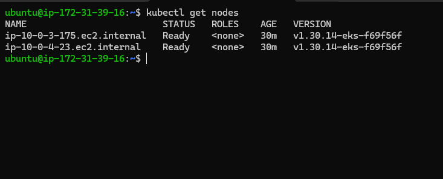
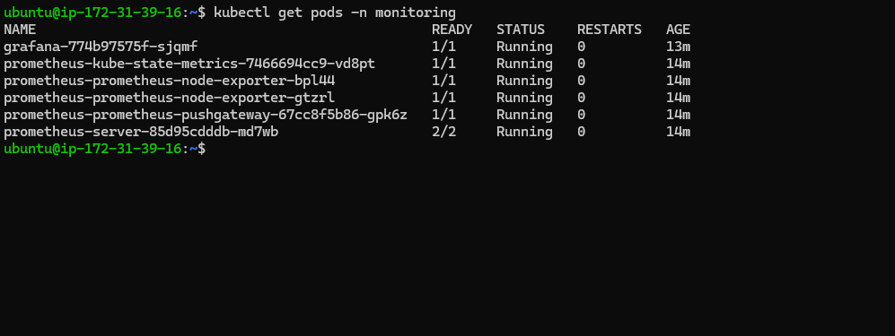
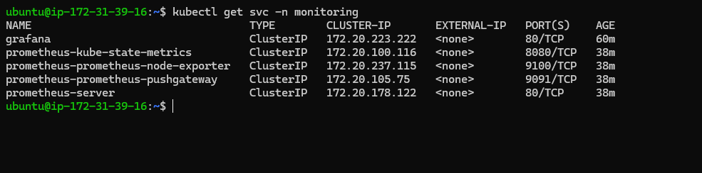
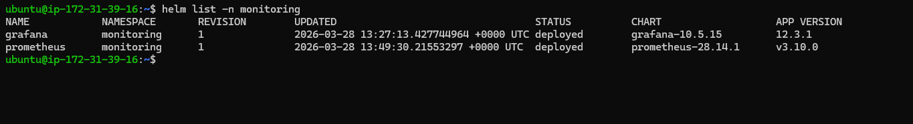
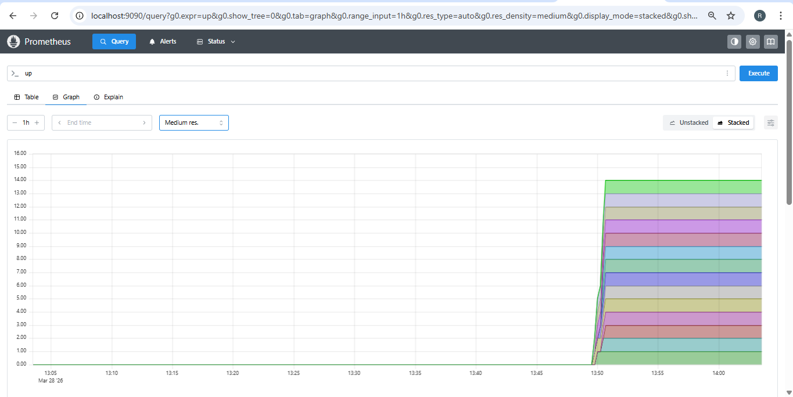
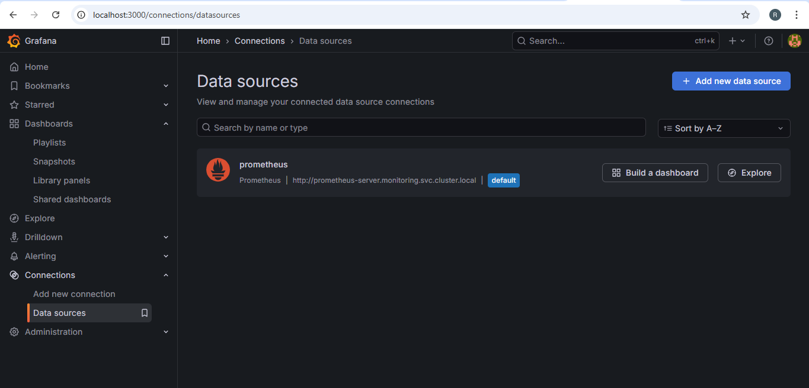
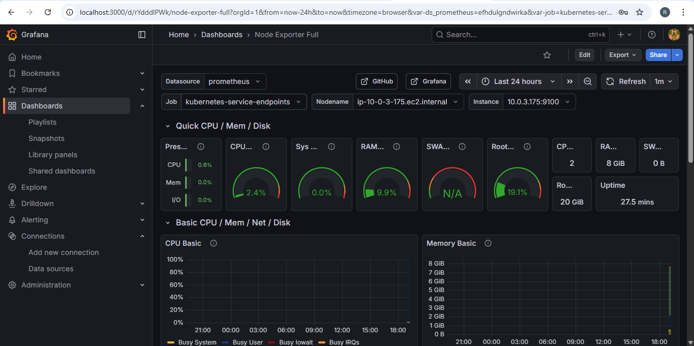

#  Kubernetes Monitoring using Prometheus & Grafana (Terraform + Helm)

---

##  Project Overview

This project demonstrates the deployment of a **monitoring stack on Kubernetes (AWS EKS)** using **Infrastructure as Code (Terraform)** and **Helm charts**.

It enables real-time monitoring and visualization of cluster and application metrics using **Prometheus** and **Grafana**.

---

##  Tech Stack

- AWS EKS (Kubernetes)
- Terraform (IaC)
- Helm (Package Manager)
- Prometheus (Monitoring)
- Grafana (Visualization)

---

##  Architecture

Developer → Terraform → EKS Cluster → Helm → Prometheus + Grafana → Dashboard

---

##  Deployment Steps

1. Provisioned EKS cluster using Terraform  
2. Configured kubectl to connect with cluster  
3. Installed Helm and added repositories  
4. Deployed Prometheus using Helm  
5. Deployed Grafana using Helm  
6. Connected Prometheus as Grafana Data Source  
7. Imported Kubernetes monitoring dashboard  

---

##  Screenshots

###  Kubernetes Nodes

---

###  Monitoring Pods

---

###  Services

---

###  Helm Releases

---

###  Prometheus UI

---

###  Grafana Login

---

###  Grafana Data Source

---

###  Grafana Dashboard

---

##  Features

- Real-time monitoring of Kubernetes cluster  
- CPU and Memory usage visualization  
- Node and Pod metrics tracking  
- Centralized dashboards using Grafana  

---

##  Benefits

- Infrastructure as Code (Terraform) ensures automation  
- Helm simplifies Kubernetes deployments  
- Prometheus provides powerful metrics collection  
- Grafana enables rich visualization  

---

##  Outcome

Successfully implemented a **scalable monitoring solution** using modern DevOps tools and practices.

---

##  Author

Ritu Patil